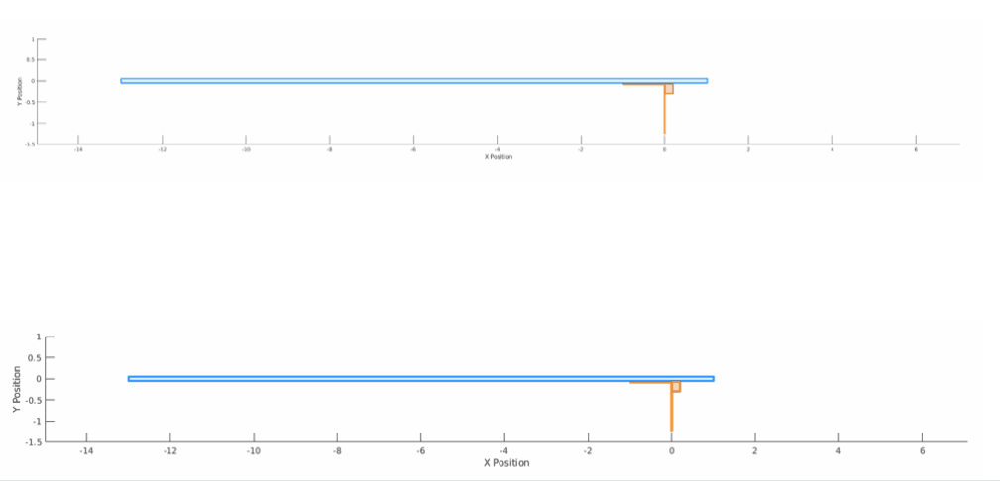
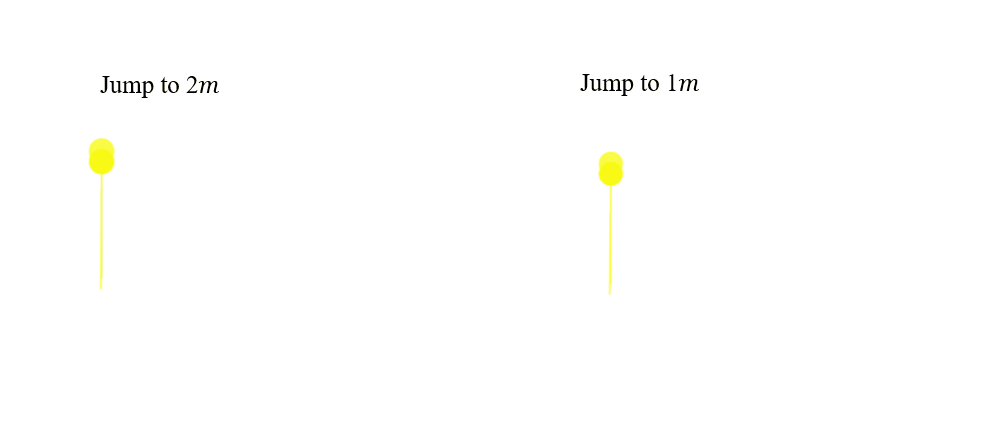
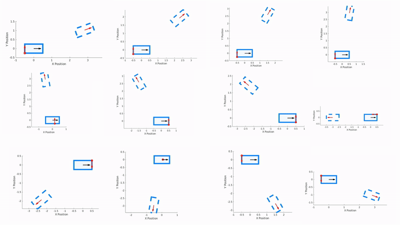
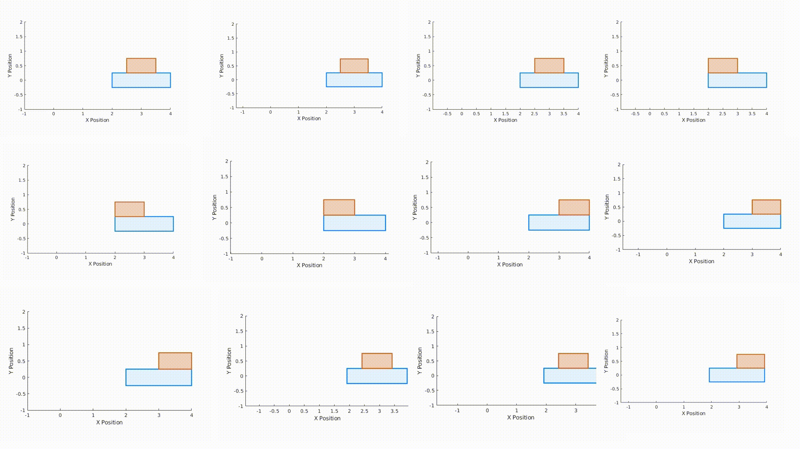
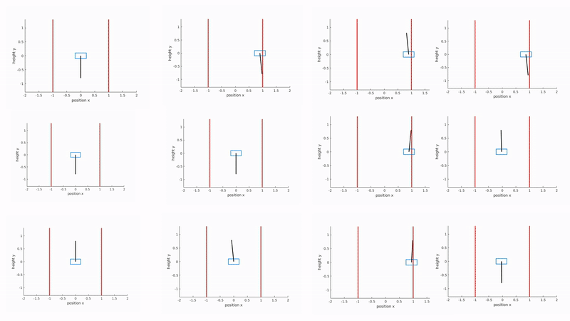

# CRISP: Robust Contact-Implicit Motion Planning with Sequential Convex Programming
**CRISP** is a C++ library developed to efficiently solve contact-implicit motion planning problems, using a customized trust region Sequential Convex Programming (SCP) algorithm.

**CRISP** computes entirely new contact sequences from naive and even all-zero initializations.

<div align="center">
  <h3>Waiter</h3>
  
</div>

<div align="center">
  <h3>Hopper</h3>
  
</div>

<div align="center">
  <h3>Push Box</h3>
  
</div>

<div align="center">
  <h3>Push T</h3>
  
</div>

<div align="center">
  <h3>Transport</h3>
  
</div>

<div align="center">
  <h3>Cartpole with Soft Walls</h3>
  
</div>

<div align="center">
  <h3>Real World Push T</h3>
  
</div>

## Features
- **CRISP** leverages [CppAD](https://coin-or.github.io/CppAD/doc/cppad.htm) and its companion, [CppADCodeGen](https://joaoleal.github.io/CppADCodeGen/), to facilitate rapid and efficient computation of necessary values and derivatives. This approach automates the generation of autodiff libraries, requiring users only to define the objective and constraint value functions. These libraries are compiled during the initial run and reused in subsequent operations, optimizing computational efficiency.


- **CRISP** accommodates both parametric and nonparametric value functions. The parametric support allows users to adjust parameters dynamically and resolve problems without the need for regenerating the autodiff libraries—ideal for applications like Model Predictive Control (MPC), where the tracking reference in the objective function might change frequently.

- Python interface **pyCRISP** is available through pybind11, enabling dynamic parameter adjustments and solver execution within a Python environment.

- All the sparse matrix and vector operations within the library are optimized and accelerated by directly memory copying under Eigen Compressed Row Storage (CRS) scheme. The large-scale sparse convex Quadratic Programming (QP) subproblems that arise are tackled using the Proximal Interior Point Quadratic Programming Solver ([PIQP](https://github.com/PREDICT-EPFL/piqp)).

## Rebuttal
1. We have added the push T task to CRISP, including both simulation and real-world experiments. The results have been visualized, and a video showcasing the outcomes has been provided.

2. We also provide the source code to reproduce the benchmarks added in this rebuttal. Specifically:
   - For push T task, we provide the MIQCP formulation as well as its gurobi implementation in `./rebuttal/pushT/pushT_gurobi.jl`. Also, we provide the source code of [GCS push T](https://github.com/bernhardpg/planning-through-contact) for different initial states in `./rebuttal/pushT/GCS_planar_pushing.ipynb`.
   - For the linear complementarity problem (LCP), we implement the transport and waiter problem following the LCP formulation in [LCQPow](https://github.com/hallfjonas/LCQPow), and the source code are provided in `./rebuttal/LCP/LCQPow`. Also, the [ADMM implementation of cartpole with softwall](https://github.com/AlpAydinoglu/coptimal/tree/main/Conference%20(ICRA2022)/cartpole) with linearized dynamics is provided in `./rebuttal/LCP/ADMM/main.py`.  


## Table of Contents

- [Installation Instructions](#1-installation-instructions)
  - [Prerequisites](#11-prerequisites)
  - [Install Third Party Libraries](#12-install-third-party-libraries)
- [Install CRISP](#2-install-crisp)
  - [Test Examples](#test-examples)
- [Usage](#3-usage)
  - [General Workflow](#31-general-workflow)
  - [C++ Interface](#32-c-interface)
  - [Python Interface](#33-python-interface)
- [Citing Our Work](#4-citing-our-work)


## 1. Installation Instructions
Download the source code from the repository
### 1.1 Prerequisites
- This library is developed and tested on Ubuntu 20.04/22.04.
- Install Common Library through `sudo apt install`
    - CMake
    - Eigen3
    - Boost
    - Yaml
    - pybind11
    - pkgconfig
    - if you miss any in your system, use `sudo apt install` to install the corresponding library.

### 1.2 Install Third Party Libraries
All third party libraries are suggested to be placed in  `./src/third_party` directory.
#### CppAD
Create and navigate into the `./src/third_party` directory:
```sh
    mkdir -p ./src/third_party
    cd ./src/third_party
```

Install the CppAD repository:
```sh
    git clone https://github.com/coin-or/CppAD.git
    cd CppAD
    mkdir build && cd build
    cmake ..
    make install
```
#### CppADCodeGen
Install the CppADCodeGen repository:
```sh
    git clone https://github.com/joaoleal/CppADCodeGen.git
    cd CppADCodeGen
    mkdir build
    cd build
    cmake ..
    make install
```


#### PIQP
Install the PIQP repository:
```sh
    git clone https://github.com/PREDICT-EPFL/piqp.git
    cd piqp
    mkdir build
    cd build
    cmake .. -DCMAKE_CXX_FLAGS="-march=native" -DBUILD_TESTS=OFF -DBUILD_BENCHMARKS=OFF
    cmake --build . --config Release
    cmake --install . --config Release
``` 
**Note**: the default CMakeLists in PIQP require cmake version 3.21, while the default cmake version in ubuntu 20.04 is lower.
```sh
cmake_minimum_required(VERSION 3.21)
```
Do not worry about this, just change the above lines in **all** related CMakeLists.txt file in the PIQP directory to fit your version. For me, it is:
```sh
cmake_minimum_required(VERSION 3.16)
```

## 2. Install CRISP
```sh
cd src
mkdir build
cmake ..
make
```
**Note**: CppAD library generate a .pc complier file, which is used to find the path of the library. It can not be found by findpackage, but can be dealt with properly by pkgconfig. 

You do not need to care about CppAD codegen, since it is a header-only library and has already been installed to the system default path.

### Test Examples
After successfully building the library, you can run the examples to verify the installation.
```sh
# in the build directory, run the following examples: 
./examples/pushbot_example
./examples/pushbox_example
./examples/cartTransp_example
./examples/waiter_example
./examples/hopper_example
```
Feel free to try different hyperparameters, and the weighted mode on these or your own problems. For local solver, the hyperparameters are important for the numerical performance. 
## 3. Usage
### 3.1 General Workflow
This solve adopts the most general optimization problem format: 

$$
\begin{aligned}
\min_{x} \quad & J(x) \\
\text {s.t.}\quad & c_i(x) = 0, \quad i \in \mathcal{E} \\
& c_i(x) \ge 0, \quad i \in \mathcal{I} \\
\end{aligned}
$$

The objective $J(x)$ is convex, while the $c(x)$ are general nonlinear nonconvex constraints. The workflow for defining your own problem and solving it with the **CRISP** is simple:
1. Define the objective function and constraints.
2. Create the ``OptimizationProblem`` , add the objective and constraints to the problem through ``addObjective``, ``addEqualityConstraint``, and ``addInequalityConstraint``.
3. Create the ``SolverInterface`` with the defined optimization problem.
4. Initialize the solver with the initial guess and solve the problem.
5. Retrieve the solution.

### 3.2 C++ Interface
Let's go through how the solver works with the pushbot example ``src/examples/pushbot/cpp/SolvePushbot.cpp``.
1. Define the objective function and constraints using the ``ad_function_with_param_t`` or ``ad_function_t ``. 

    The ``ad`` typed variables are just wrappers to enhance the Eigen base type with CppAD and code generation functionality. So you can **operate them in Eigen style** to ease your definition of the objective and constraints. ``x`` is all the independent variables, ``y`` is the function value and ``p`` is the parameters.

    Here is the example of the objective function, the objective function is designed as a quadratic form to track the terminal states and minimize the control effort, where the terminal states serves as parameters ``p``.  
    
    Similar for all other constraints and we refer to the source code for more details.
```cpp
ad_function_with_param_t pushbotObjective = [](const ad_vector_t& x, const ad_vector_t& p, ad_vector_t& y) {
    y.resize(1);
    ad_scalar_t tracking_cost(0.0);
    ad_scalar_t control_cost(0.0);
    ad_matrix_t Q(num_state, num_state);
    Q.setZero();
    Q(0,0) = 100;
    Q(1, 1) = 100;
    Q(2, 2) = 100;
    Q(3, 3) = 100;
    ad_matrix_t R(num_control, num_control);
    R.setZero();
    R(0, 0) = 0.001;

    for (size_t i = 0; i < N; ++i) {
        ad_vector_t state(num_state);
        for (size_t j = 0; j < num_state; ++j)
            state(j) = x(i * (num_state + num_control) + j);

        ad_vector_t control(num_control);
        for (size_t j = 0; j < num_control; ++j)
            control(j) = x(i * (num_state + num_control) + num_state + j);
        
        // terminal cost
        if (i == N - 1) {
            ad_vector_t tracking_error = state - p;
            tracking_cost += tracking_error.transpose() * Q * tracking_error;
        }

        if (i < N - 1) {
            ad_vector_t control_error = control;
            control_cost += control_error.transpose() * R * control_error;
        }
    }

    y(0) = tracking_cost + control_cost;
};
```
2. After defining the objective function and constraints, we create the ``OptimizationProblem`` and add the objective and constraints to the problem.
```cpp
    std::string problemName = "PushbotSwingUp";
    std::string folderName = "model";
    OptimizationProblem pushbotProblem(variableNum, problemName);

    auto obj = std::make_shared<ObjectiveFunction>(variableNum, num_state, problemName, folderName, "pushbotObjective", pushbotObjective);
    auto dynamics = std::make_shared<ConstraintFunction>(variableNum, problemName, folderName, "pushBotDynamicConstraints", pushBotDynamicConstraints);
    auto contact = std::make_shared<ConstraintFunction>(variableNum, problemName, folderName, "pushBotContactConstraints", pushBotContactConstraints);
    auto initial = std::make_shared<ConstraintFunction>(variableNum, num_state, problemName, folderName, "pushBotInitialConstraints", pushBotInitialConstraints);

    // ---------------------- ! the above four lines are enough for generate the auto-differentiation functions library for this problem and the usage in python ! ---------------------- //

    pushbotProblem.addObjective(obj);
    pushbotProblem.addEqualityConstraint(dynamics);
    pushbotProblem.addInequalityConstraint(contact);
    pushbotProblem.addEqualityConstraint(initial);
```
If a function is parametric, the second input when generate the ObjectiveFunction or ConstraintFunction should be the number of parameters. For example, in objective function, the second input is `num_state`, which is the number of terminal states.

The function names: "pushbotObjective", "pushBotDynamicConstraints" ... are important for load the previous generated autodiff library and set/get corresponding problem parameters. These should be consistent when you change the parameters dynamically using ``.setParameters()``. To give you a hint, the autodiff library generated for the defined functions follows the conventions:
```sh
src/build/model/PushbotSwingUp/auto_generated /PushbotSwingUp_pushbotObjective_cppad_cg_model.so
src/build/model/PushbotSwingUp/auto_generated /PushbotSwingUp_pushBotDynamicConstraints_cppad_cg_model.so
src/build/model/PushbotSwingUp/auto_generated /PushbotSwingUp_pushBotContactConstraints_cppad_cg_model.so
src/build/model/PushbotSwingUp/auto_generated /PushbotSwingUp_pushBotInitialConstraints_cppad_cg_model.so
```
And it won't be regenerated (it will load the model instead) if the system find these files. If your model parameters for defining the the functions have changed (like the mass, time steps, etc.), you should regenerate the autodiff library by setting the flag to true, e.g., 
```cpp 
auto obj = std::make_shared<ObjectiveFunction>(variableNum, num_state, problemName, folderName, "pushbotObjective", pushbotObjective, true);
```
or simply delete the files such that the system will not find the library and regenerate them.

3. Then, you can create the solver interface with the defined problem, adjust problem parameters for those parametric functions (**mandatory**) and solver hyperparameters (**optional**), and solve the problem.
```cpp
    SolverParameters params;
    SolverInterface solver(pushbotProblem, params);
    // set the parameters for those parametric functions: mandatory
    solver.setProblemParameters("pushbotObjective", xFinalStates);
    solver.setProblemParameters("pushBotInitialConstraints", xInitialStates);
    // set the hyperparameters for the solver: optional
    solver.setHyperParameters("verbose", vector_t::Constant(1, 1));
    // initialize the solve with initial guess and solve the problem
    solver.initialize(xInitialGuess);
    solver.solve();
    solver.getSolution();
```
```cpp
    // if you change a initial states and some problem parameters, you can reset and solve the problem again.
    solver.setProblemParameters("pushBotInitialConstraints", xInitialStates);
    solver.resetProblem(xInitialGuess);
    solver.solve();
    solver.getSolution();
```


### 3.3 Python Interface
Make sure you have gone through the C++ workflow and have the autodiff libraries generated. Since the autodifferentiation functions can be defined in parametric ways, currently we adopt the way to generate the library in C++ once and develop your code in python for all. Future development would provide a way to define the functions in python directly combining library like CASADI.
```cpp
    std::string problemName = "PushbotSwingUp";
    std::string folderName = "model";
    OptimizationProblem pushbotProblem(variableNum, problemName);

    auto obj = std::make_shared<ObjectiveFunction>(variableNum, num_state, problemName, folderName, "pushbotObjective", pushbotObjective);
    auto dynamics = std::make_shared<ConstraintFunction>(variableNum, problemName, folderName, "pushBotDynamicConstraints", pushBotDynamicConstraints);
    auto contact = std::make_shared<ConstraintFunction>(variableNum, problemName, folderName, "pushBotContactConstraints", pushBotContactConstraints);
    auto initial = std::make_shared<ConstraintFunction>(variableNum, num_state, problemName, folderName, "pushBotInitialConstraints", pushBotInitialConstraints);

    // ---------------- the above codes are enough for generate the auto-differentiation functions library for this problem and the usage in python ---------------- //
```
The Python interface is built on top of the C++ library and provides a convenient way to interact with the solver in a Python environment. 

The Python interface is built using pybind11 and can be found in the `src/python` directory. The Python interface is designed to be simple and easy to use, with the same workflow as the C++ interface. 

Except that we don't need to specify the function handles (obj, constraints) as we assume the autodifferentiation has already been generated with the following naming convention:
problem name: "PushbotSwingUp"; folder name: "model"; function name: "pushbotObjective", "pushBotDynamicConstraints", "pushBotContactConstraints", "pushBotInitialConstraints".

the autodifferentiation function library would be loaded automatically and only once. And then you are able to set different problem parameters and solver hyperparameters in the python interface for solving and re-solving the problem.

The following example shows how we set up and solve the pushbot swing up problem using the python interface. ``src/examples/pushbot/python/SolvePushbot.py``
```python
import numpy as np
import os
import sys
# add the generated python bindings to the path, defalut path is path/to/build/core
sys.path.append(os.path.join(os.path.dirname(__file__), '../../../build/core')) # Add the path to generated python bindings
import pyCRISP

# In the python example, the workflow is similar to the C++ example. 
# Except that we don't need to specify the function handles (obj, constraints) as we assume the autodifferentiation has already been generated with the following naming convention:
# problem name: "PushbotSwingUp"; folder name: "model"; function name: "pushbotObjective", "pushBotDynamicConstraints", "pushBotContactConstraints", "pushBotInitialConstraints".
# the obj and constraints functions can be defined in both parametric and non-parametric ways. The parametric way is useful for dynamically adjusting problem parameter like the tracking ref, terminal states.

# If your problem itself is not changed (the dynamics or constraints themself), the autodifferentiation function library would be loaded automatically and only once. And then you are able to set different problem parameters and solver hyperparameters in the python interface for resolve the problem.
# The following example shows how we set up and solve the pushbot swing up problem using the python interface.


num_state = 4
num_control = 3
N = 100

# 1. Create optimization problem. 
# Notice that the problem name, folder name, and function name should be the same as the ones in the model file for the system to load the autodifferentiation functions
variableNum = N * (num_state + num_control)
problemName = "PushbotSwingUp"
folderName = "model"
problem = pyCRISP.OptimizationProblem(N * (num_state + num_control), "PushbotSwingUp")


# 2. Create objective and constraints objects. In py interface, we don't need to specify the function handles as we assume the autodifferentiation has already been generated
# If the function is parameterized, the second argument should be the number of parameters
obj = pyCRISP.ObjectiveFunction(variableNum, num_state, problemName, folderName, "pushbotObjective")
dynamic = pyCRISP.ConstraintFunction(variableNum, problemName, folderName, "pushBotDynamicConstraints")
contact = pyCRISP.ConstraintFunction(variableNum, problemName, folderName, "pushBotContactConstraints")
initial = pyCRISP.ConstraintFunction(variableNum, num_state, problemName, folderName, "pushBotInitialConstraints")

# 3. Add obj and constraints to the problem
problem.add_objective(obj)
problem.add_equality_constraint(dynamic)
problem.add_inequality_constraint(contact)
problem.add_equality_constraint(initial)

# 4. Set problem parameters, as the functions can be defined in both parametric and non-parametric ways, the problem parameters can also be adjusted dynamically after creating the solver object.
x_initial_states = np.zeros(num_state)
x_final_states = np.array([0, 0, 0, 0])

# Read initial guess from a file, you can also set it to your own test values.
x_initial_guess = np.loadtxt('/home/workspace/src/examples/pushbot/initial_guess_pushbot_example.txt')
x_initial_states[:] = x_initial_guess[:num_state]


# 5. Initialize the solver hyperparameters, and you can change the hyperparameters here or after 
params = pyCRISP.SolverParameters()
solver = pyCRISP.SolverInterface(problem, params)

# set the parameters for those parametric functions: mandatory
solver.set_problem_parameters("pushbotObjective", x_final_states) # the objective parameters are the terminal states for calculating the terminal cost
solver.set_problem_parameters("pushBotInitialConstraints", x_initial_states)
# set the hyperparameters for the solver: optional
# params.set_hyper_parameters("verbose", np.zeros(1))
solver.initialize(x_initial_guess)
solver.solve()

# 7. Get the solution. Note that the solution and all intermediate results are automatically saved to path/to/build/results folder in .mat format for further analysis and visualization in matlab.
solution = solver.get_solution()

# 8. Optional: 
# Dynamically change the problem parameters and solver hyperparameters and solve the problem again.
# solver.set_hyper_parameters("max_iter", np.array([500]))
# solver.set_problem_parameters("pushbotObjective", np.array([0.5, 0, 0, 0]))
# x_initial_new = 0.1 * np.random.rand(variableNum)
# solver.reset(x_initial_new)
# solver.solve()
# solution = solver.get_solution()

```